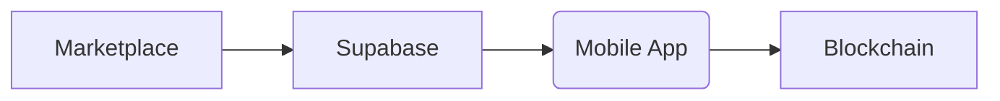

Signature process:

The process start on marketplace with an authenticated user calling the [[buyNfts]] endpoint with the nft address, id and user's token. The transaction is inserted on the [[orders table]] and broadcasted. The mobile app will recieve a new event with the unsigned transaction and will prompt for the user's approval, if accpted the transaction is send to be processed on the blockchain, completing this way the transaction lifecycle.